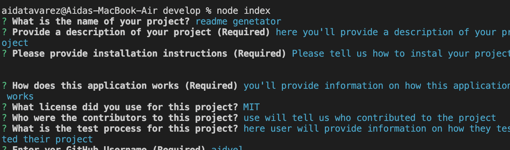

# readme-generator: Node.j and ES6+

## Desciption

Every good project needs a quality README with information about the app - what the app is for, how to use the app, how to install it, how to report issues, and how to make contributions so that other developers are more likely to use and contribute to the success of the project.

This is a command-line application that runs with Node.js that dynamically generates a README.md file based on input about your project.


  # Table of Content)
  - [Installation](#Installation)
  - [Usage](#Usage)
  - [Github](#Username)
  - [Profile](#Profile)
  

## Installation 
To generate your own README, ``` git clone ``` the repo down to your local so you have the Node project on your local.

Run npm install in order to install the following npm package dependencies as specified in the package.json:
        * inquirer will prompt you for your inputs from the command line.
        * axios will fetch your info from the GitHub API.

The application will start by running   ```node index.js``` in the command line.

Answer the prompts in your command line to generate the README.

After answering all the prompts, your README file will be named 'README.md' and will be ready for you at the root of the repo.


## Usage 



When you run ```node index.js``` , the application uses the inquirer package to prompt you in the command line with a series of questions about your GitHub and about your project.


## Websites 
*[Gihub Repository](https://github.com/aidyel/readme-generator)

*[Vide demonstration](https://drive.google.com/file/d/19VXOuiYNo1-oobN23nuYJvV5tFN3DINs/preview)